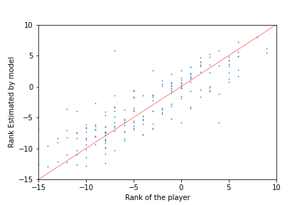
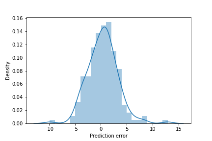
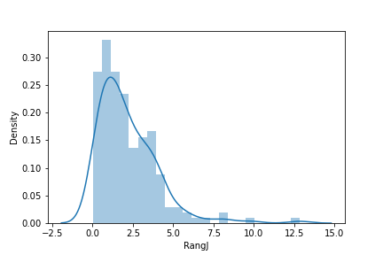

- For the installtion, go directly to the **Installation** subcategory
- For the french version, open the file "**README_like_one_of_your_french_files.md**"
# Context

Current methods of ranking in Go rely mostly on an Elo system where the player win or loose some points after a game depending of the output (game won or lost) and the difference in rank between the player and his opponent. Those Elo points are then converted into the ranking system kyu-dan.

|    Elo (FR)    |     Rank      |   Elo (EU)   |
|:--------------:|:-------------:|:------------:|
| -2000 to -1901 |   **20 kyu**  |  1 to 100    |
| -1900 to -1801 |   **19 kyu**  |  101 to 200  |
| -1800 to -1701 |   **18 kyu**  |  201 to 300  |
|      ...       |       ...     |     ...      |
|  -400 to -301  |   **4 kyu**   | 1601 to 1700 |
|  -300 to -201  |   **3 kyu**   | 1701 to 1800 |
|  -200 to -101  |   **2 kyu**   | 1801 to 1900 |
|   -100 to -1   |   **1 kyu**   | 1901 to 2000 |
|    0 to 99     |   **1 dan**   | 2001 to 2100 |
|   100 to 199   |   **2 dan**   | 2101 to 2200 |
|       ...      |       ...     |      ...     |
|   600 to 699   |   **7 dan**   | 2601 to 2700 |


Multiple algorithms exist to update the player's rank, from the simple ones, based on the rank of both oppenent and the outcome of the game, as the ones used by the [French Federation of Go](https://ffg.jeudego.org/echelle/echelle_algo_2012.php), to more complex ones like the [Whole History Rating](https://www.remi-coulom.fr/WHR/) which takes into account the time-varying strengths of players. However, for all of those algorithms, the initial assessment must always be self-declarative (or initialized as the lowest possible) as there is no way to watch a player's moves and directly determine its rank.

Even more, these methods suffer from multiple major limitations for a reliable estimation of a rank :

1. They require multiple games to adjust the true level of someone which is making fast progresses, therefore, their ranking does not always represent their real level and capabilities.

2. These methods are higly suceptible to the arrival of new waves of players, as if a lot of new player arrive, the previously middle-ranked players which have some experience will win a lot of games against those freshmens arriving, increasing their rank even though their true level and strength did not change. This problem often requires the need of players called [anchors](https://www.gokgs.com/help/anchor.html), players that are supposedly very stable and do not get better over time, and that are used to recalibrate everyone.

3. Finally, these method are also highly biaised by the geographical and time locations of each players. For example, a rank of 1 dan does not represent the same strength in different countries, we also have no way to know if someone ranked 1 dan today, has the same strength than someone ranked 1 dan that lived centuries ago, as there is no way for a "21st century 1 dan" to play against a "XVIIe century 1 dan" and compare which of them was better.

For all these reason the ranking system needs a more accurate and also faster way to determine the level of a player

In order to do so, a good alternative would be to increase or decrease the points a player after a game according to the real strength of the moves he played during the game, rather than the level of his opponent, This has been made possible with the arrival of deep learning capable of defeating any human by better estimating the value of each moves in any situation on the board. Initiated by Google with AlphaGo, the use of deep learning in Go widely spread with models like leela or katago that can be run on almost any computer, with or without GPU, and are better than professional players.

# Presentation
Based on a Machine learning approach, this model was trained on more than 500 games and more than 500 different players ranking from 16 kyu to 9 dan, 

The games used for training the model come from the Go Server KGS, on labelized data from people with a stable rank.
For all the games, every move of the players were analyzed by Katago and the performance of both players on the full game were used to train the predictive model. 
Only games with more than xx moves were retained 

# Performances assessment

While the predictions can intrinsically not return the exact level of all players on the testing set because :
1. KGS ranks suffer from the same limitations as listed above, knowing that it is slow to adapt the real level of a player, and a player labelized as 12 kyu  can for example already play like a 11 kyu or a 10 kyu
2. Most player (as all humans) are not highly constant in their concentration and performances, and even if the overall level of the person is for example 12 kyu and stable over time, the player can sometime suffer from fatigue and play like a 13 or 14 kyu if he is tired, or on the other way around, he can sometime be more involved in some games (in tournament for example) and focus more on each move and have a game where he plays better than his usual level and play like a 10 or 9 kyu on games he values more. Those up and dones give him a stable of 12 kyu even though he'll sometime play better, sometime worse.

If we take into account that a player with a fixed rank does not play every game with the same strength, the performances of the model are strongly accurate and allow the establishment of a quick and reliable assessment of the person's level.

The median error of rank estimation being less than 2, which is in the range of strength variation of a player,we can assume that the difference between the prediction given by the model and the official rank of the player at the time he played the game, can be mainly imputed to the human performance variation.





# Installation
## Requirements 
### If you're familiar with python or programming 
`- Language :` Python 3 or more,

`- Libraries :` Refer to the requirements.txt file

`- Models :` You will need two models to make it run :
1. The first one to assess the strength of every move played during the game, that you can download on the github of Katago, [here for Windows with only CPU](https://github.com/lightvector/KataGo/releases/download/v1.10.0/katago-v1.10.0-eigen-windows-x64.zip) or [here](https://github.com/lightvector/KataGo/releases) if you want a GPU version or if you're using Linux or Mac.
2. The second one to predict the rank of the player on the KGS scale, according to his moves. This one is present in this project and don't need any extra-downloads
### If reading code lines gives you headaches
To run it : 
- Be sure to have python installed on your machine 
>    - if you don't have it, just download and install [anaconda for windows](https://repo.anaconda.com/archive/Anaconda3-2021.11-Windows-x86_64.exe)
 or [anaconda for mac](https://repo.anaconda.com/archive/Anaconda3-2021.11-MacOSX-x86_64.pkg)
- After the installation is complete, clone this repo (or download the [folder](https://github.com/Jeremy-Deh/GoRankAnalysis/archive/refs/heads/main.zip) and unzip it) 
- Go in the main folder and double-click "install.bat" (if you're on Windows) to make sure you have all python dependencies that are needed for the program to run. 

## Settings
In `GoPredict.py` find :
```python
settings = {
    "fast_visits": 25,
    "max_visits": 500,
    "threads": 64,
    "model": "C:\\Users\\jerem\\Documents\\Go\\Katago\\g170-b40c256x2-s5095420928-d1229425124.bin.gz",
}
```
and change the `C:\\Users\\jerem\\Documents\\Go\\Katago\\g170-b40c256x2-s5095420928-d1229425124.bin.gz` for the pthway and name of the .bin.gz that you've got 

# Rank prediction
To make your own estimation of the level of your games : 
- Place your .sgf file if the folder named "data"
- Launch the file `GoPredict.py`
- Open the newly created file "prediction.csv"